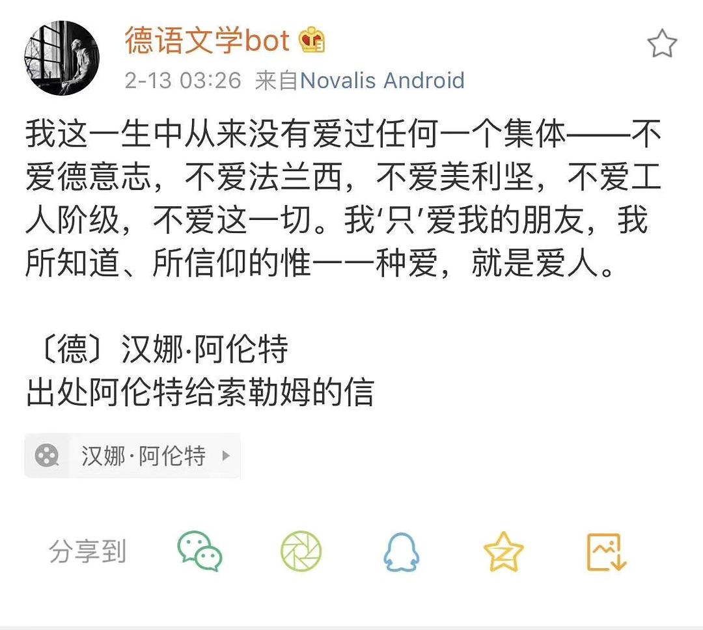

来源：[阿伦特在胡同（来自豆瓣）](https://www.douban.com/people/208706900/)的[广播](https://www.douban.com/people/208706900/status/2810652763/)

2020-02-14_17:44:35

最近因为整理资料素材，信息过载，一直处于失语的状态。想说的话太多，又不知道从哪儿开始。

阿伦特在《极权主义的起源》 中的一段话最近总会在浮现出来，“极权主义政府像一切暴政一样，不摧毁公共生活，亦即假如不用使人孤立的方法来摧毁人的政治能力，就无法存在。但是，极权统治作为一种政府形式是不同于以往的，因为它不满足于这种孤立，并且要摧毁私人生活。它的自身基础是孤独，是根本不属于世界的经验，这是人类经验中最彻底、最绝望的一种。”

根据阿伦特的说法，这种孤独与无根和成为多余的情境紧密相关，“无根意味着在这个世界上没有立足之地，不受别人的承认和保障；成为多余者意味着根本不属于这个世界”。而这与人的根本需求——对归属、安全的需求——相反，这同时也和人的生活经验相反，我们都需要在和他人的接触中，确认自己的经验和身份。

如果说最近有什么感触，大概就是更深刻地理解了这些理论。挺幸运的，在这次疫病期间遇到了很多善良又坚定的人，让自己不至于觉得孤立和无所适从。昨天看到德语文学bot的微博引用了汉娜·阿伦特写给肖勒姆信中的这段话，也是自己之前的微博置顶，还是感受到一股暖意。

“I am not moved by any ‘love’ of this sort, and for two reasons: I have never in my life ‘loved’ any people or collective – neither the German people, nor the French, nor the American, nor the working class or anything of that sort. I indeed love ‘only’ my friends and the only kind of love I know of and believe in is the love of persons.”

如果你也一直在持续关注最近密集发生的各种惨剧，希望你可以照顾好自己情绪，希望大家可以被“同伴情谊”拯救。这个瓦伦丁如果我们一定要应景地聊聊“爱”，那么就是这一种吧。：）
  

